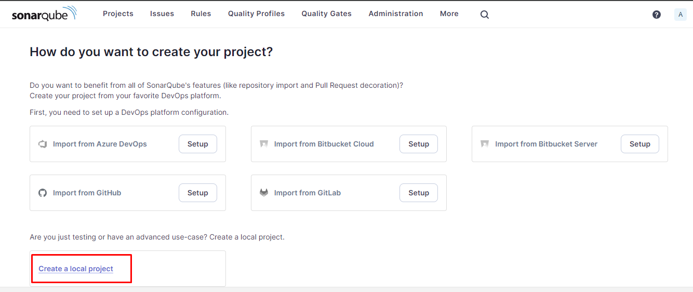
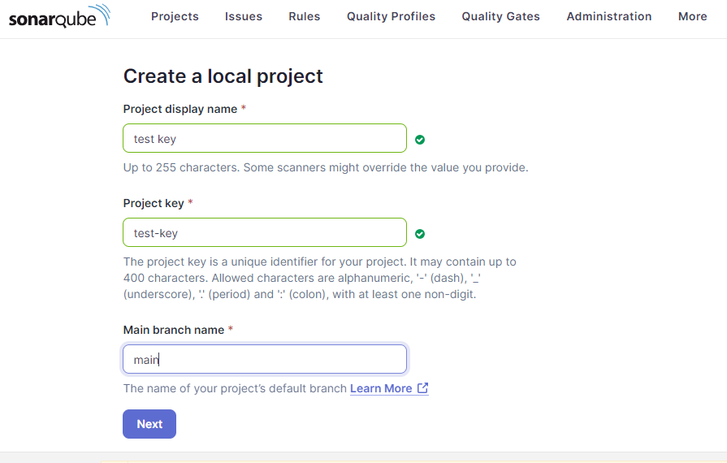
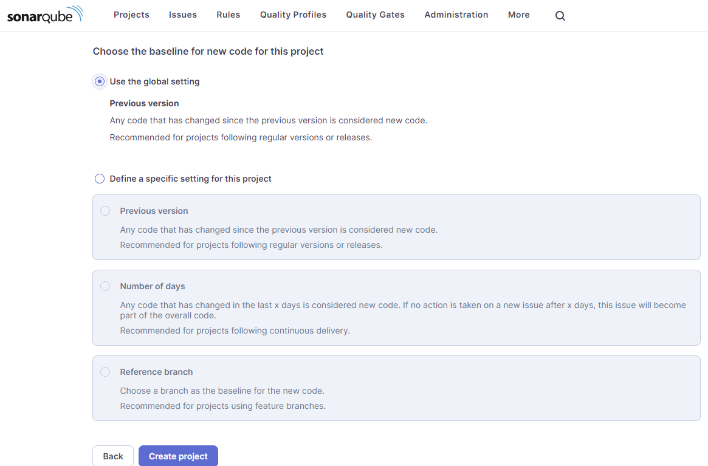
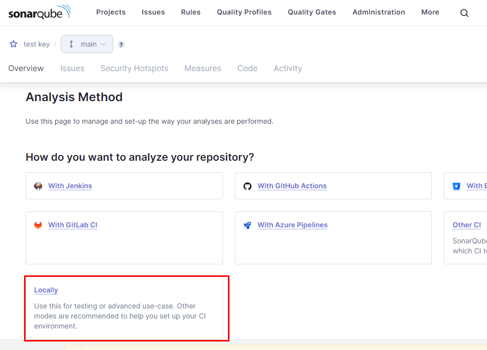
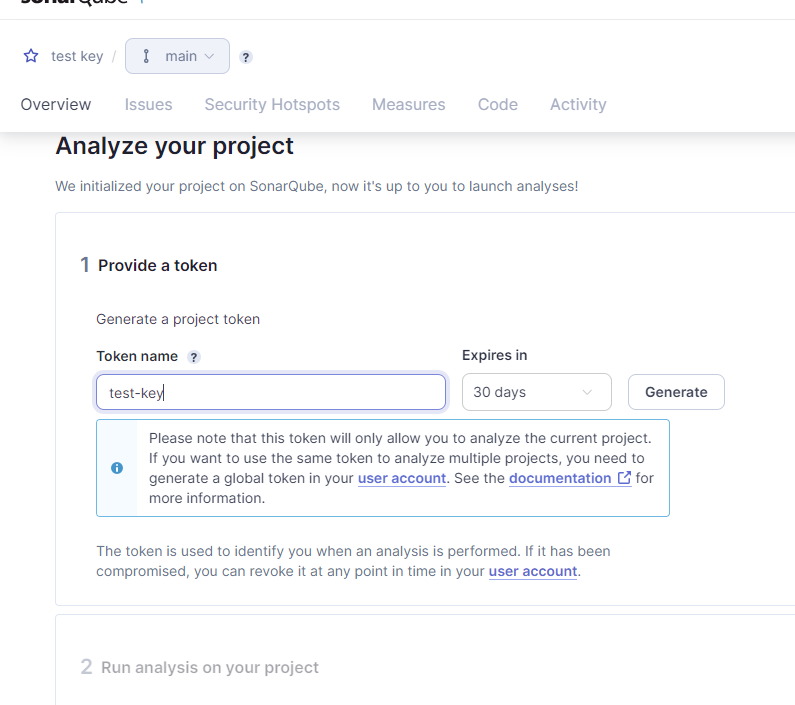
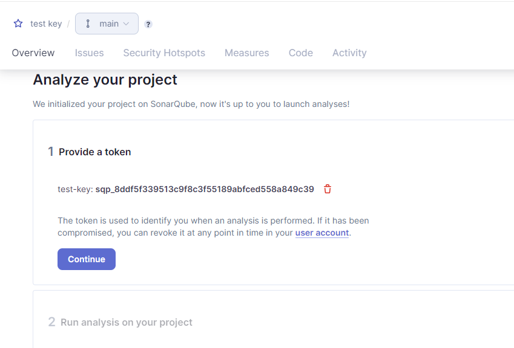

1. Deploy Terraform resources
2. you will get 2 outputs 1 for sonarqube and another for jenkins
3. and you will notice JENKINS secreat key at terminal ( where you run terraform apply command)
4. browse soanrqube url and enter admin and admin as username and password, and change the sonarqube password
5. Follow these steps

6. Now Login to jenkins, username admin password as from terminal
7. install required plugins
8. Add SONAR_TOKEN to jenkins secrets as text
9. goto manage jenkins --> install plugins --> select sonarqube, aws credentials, node js
10. setup sonarqube in jenkins from this ref: https://www.geeksforgeeks.org/how-to-integrate-sonarqube-with-jenkins/
11. now go to jenkins pipeline --> enter name --> scrool down select pipeline src --> and build

